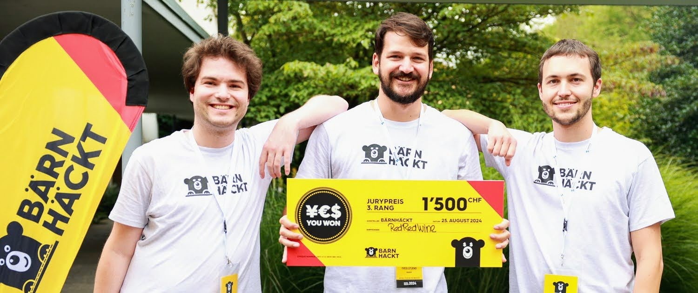
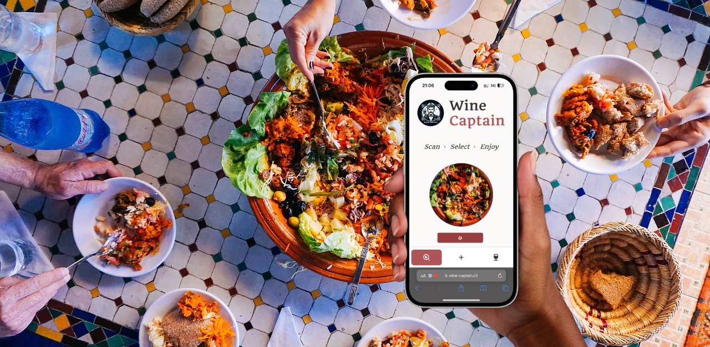

# About Wine Captain 🍷

We are thrilled to announce that Wine Captain won 3rd place 🥉 at the [BärnHäckt 2024 hackathon](https://www.bernhackt.ch/)! 🎉

## How It Works

1. **📸 Take a Photo**: Snap a picture of your meal.
2. **🤖 Get a Recommendation**: Our AI analyzes your dish and suggests the best wine.
3. **🍽️ Enjoy Your Meal**: Delight in the perfect wine pairing.

## Why Choose Wine Captain?

- **🎯 Accurate Pairings**: We use advanced AI to ensure you get the best match.
- **🚀 Ease of Use**: No need for complex installations – our PWA is ready to use in your browser.
- **🔄 Constantly Improving**: We refine our recommendations with each use.

  <VPButton theme="brand" href="https://wine-captain.ch" text="Try Wine Captain Now" />

Start exploring the world of wine with Wine Captain today!

<MusicComponent />

::: info
This project was created during the BärnHäckt 2024 hackathon. It is a proof of concept for an AI-powered wine recommendation system designed to enhance your dining experience by pairing the perfect wine with your meal.
:::

